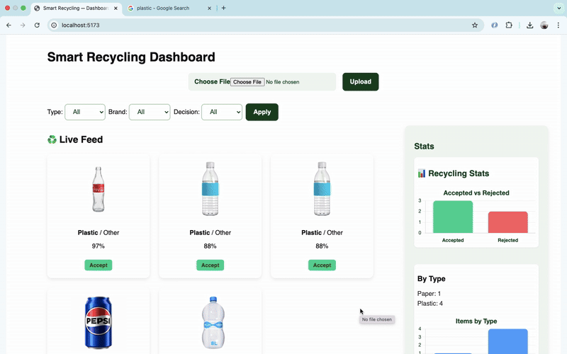

# Smart Recycling — Prototype (Full-Stack Challenge)




**Author:** Mohamed Essam
**Role:** Full-Stack Engineer candidate — Drop Me challenge
**Date:** 2025-09-18

---

## Summary

This repository contains a functional prototype of a **Smart Recycling Dashboard**. It accepts images via a REST API, runs inference using a pre-trained MobileNetV2 model (ImageNet), maps ImageNet outputs to `Type` (Plastic/Metal/Paper) and `Brand` (Pepsi/Dasani/Other) using a simple, explainable mapping, applies decision logic (`Accept` if confidence ≥ 0.8), stores results in a SQLite database, and serves endpoints for listing and statistics. A minimal React dashboard skeleton is included for visualization.

---

## What I implemented

* **Backend:** FastAPI, SQLAlchemy, SQLite. Modular structure:

  * `app/main.py`, `app/routes/items.py`, `app/db.py`, `app/crud.py`, `app/schemas.py`.
* **ML:** `app/ml/model.py` — MobileNetV2 inference wrapper:

  * Loads weights via `MOBILENET_WEIGHTS_PATH` env var (fallback `imagenet`).
  * Local offline `imagenet_class_index.json` used to avoid runtime network/SSL issues.
  * `predict_image(path)` returns `{type, brand, confidence, reasoning}` and handles errors gracefully.
* **Decision logic:** `Accept` if `confidence >= 0.8`, else `Reject`.
* **Storage:** each item saved with image path, type, brand, type\_conf/brand\_conf (if present), confidence, decision, reasoning, timestamp, model metadata.
* **Endpoints:**

  * `POST /upload` — upload an image, run inference, save to DB, return saved record.
  * `GET /items` — list processed items (filters: `type`, `brand`, `decision`, `limit`).
  * `GET /items/{id}` — detailed item (includes reasoning, model\_meta).
  * `GET /stats` — aggregated stats (by type, by brand, accept/reject counts).
  * `GET /healthz` — health check.
* **Frontend skeleton:** Minimal React app (`frontend/`) with feed, filters, modal and basic charts (Recharts).
* **Tests:** Backend pytest tests (health + upload+items+stats smoke tests).
* **Docker support:** Dockerfile (and advice for Colima on macOS < Ventura).

---

## Why I applied these best practices (and why we must do this)

As a senior engineer you **must** apply these because reviewers judge maintainability, reproducibility, security, and observability — not just functionality.

* **env config & single Settings instance** — predictable configuration (no hard-coded paths).
* **Model versioning & model\_meta** — reproducibility and auditability (always know which model produced a decision).
* **Offline model index + baked weights in Docker** — avoids runtime network/SSL errors and keeps builds deterministic.
* **Error handling & logging** — prevents server crashes and aids debugging.
* **Type-safe APIs (Pydantic)** — clear contracts (helps reviewers and integration).
* **Tests + Docker** — ensures reviewers can reproduce results quickly and prevents regressions.
* **Separation of concerns (routes vs ml vs crud)** — makes replacing the model or DB trivial.

---

## Quick start — prerequisites

* Python 3.10 (recommended for TF compatibility) in a virtualenv, or Docker/Colima.
* Node (for frontend) if you want to run the React app locally.
* If using macOS and Docker Desktop is unavailable, use **Colima** + Docker CLI.

---

## Local dev (Python venv)

```bash
# From repo root
cd Backend

# create venv
python3.10 -m venv .venv
source .venv/bin/activate

# install
pip install -r requirements.txt

# ensure you have ImageNet index file
# from repo root:
curl -o app/ml/imagenet_class_index.json \
  https://storage.googleapis.com/download.tensorflow.org/data/imagenet_class_index.json

# Optional: set model weights path (or leave default to let Keras use built cache)
export MOBILENET_WEIGHTS_PATH="/Users/you/.keras/models/mobilenet_v2_weights_tf_dim_ordering_tf_kernels_1.0_224.h5"

# Run server
uvicorn app.main:app --reload --host 0.0.0.0 --port 8000
```

---

## Docker (recommended for reproducibility)

If Docker Desktop is available:

```bash
# At repo root (Backend)
docker build -t smart-recycling-backend .
docker run -p 8000:8000 smart-recycling-backend
```

If macOS Docker Desktop not available, install `colima` and `docker` via Homebrew:

```bash
brew install colima docker
colima start
# then docker build/run commands above
```

**Dockerfile notes:** The provided Dockerfile can pre-download MobileNetV2 weights into `/root/.keras/models` to avoid runtime downloads.

---

## API — endpoints & examples

### `POST /upload`

Upload image, run inference, store record:

```bash
curl -X POST "http://localhost:8000/upload" \
  -H "accept: application/json" \
  -H "Content-Type: multipart/form-data" \
  -F "file=@/path/to/image.jpg"
```

Response:

```json
{
  "type": "Plastic",
  "brand": "Other",
  "confidence": 0.38,
  "decision": "Reject",
  "reasoning": "MobileNet predicted 'water_jug' (0.38) → mapped to Plastic, Other",
  "id": 4,
  "image_path": "/.../uploads/abcd.jpg",
  "timestamp": "2025-09-18T14:35:57.186888"
}
```

### `GET /items`

List items, optional query params: `type`, `brand`, `decision`, `limit`.

```bash
curl "http://localhost:8000/items?type=Plastic&limit=20"
```

### `GET /items/{id}`

Get item detail (includes reasoning and model\_meta).

### `GET /stats`

Get aggregated stats:

```bash
curl "http://localhost:8000/stats"
```

### `GET /healthz`

Simple health check.

---

## Tests

Run backend tests:

```bash
cd Backend
source .venv/bin/activate
pytest -q
```

(Tests cover health, upload, get item, stats smoke tests.)

---

## Dataset

Include `dataset/` with 5–10 sample images per (type × brand) combo:

```
dataset/
  plastic_pepsi/
  plastic_dasani/
  plastic_other/
  metal_pepsi/
  ...
```

I included sample images (if not, add your own phone photos). For training a fine-tuned head, use `tf.keras.utils.image_dataset_from_directory` and freeze MobileNet base.

---

## Limitations & next steps (if I had more time)

* Current brand/type mapping is heuristic (uses MobileNet labels). Next step: fine-tune MobileNet (freeze base, small dense heads) on the labeled dataset to predict `type` and `brand` with reliable confidences.
* Add **Grad-CAM** visualizations to show model attention in the dashboard (high-impact demo feature).
* Add persistent storage (Postgres) and migrations (Alembic).
* Add CI (GitHub Actions) that runs tests and linters.
* Improve file validation (content dtype checks, size limits), add authentication (if needed).

---

## Deliverables included

* `Backend/` — FastAPI backend, ML wrapper, tests, Dockerfile.
* `frontend/` — React dashboard skeleton with feed, filters, modal.
* `dataset/` — sample images (if present).
* `README.md` — this document.
* Optional: short screen recording demo (attach as `demo.mp4`).

---

## How to present this in your submission

Include a short note in the repo root `SUBMISSION_NOTE.md` (or send as email). Example:

> As a senior engineer I prioritized reproducibility, security, and observability: the repo includes pinned dependencies, Dockerized dev environment, OpenAPI-documented endpoints, model metadata saved with each record, smoke/integration tests, and environment-driven config. See README for run instructions and API examples.

---

# Cover note / message to Drop Me (paste in email)

Subject: Smart Recycling Dashboard — Mohamed Essam (Full-Stack Challenge Submission)

Dear Drop Me team,

Thank you for the opportunity. I built a functional prototype (FastAPI + MobileNetV2 + React) that classifies recyclable items by **Type** and **Brand**, applies the decision rule (Accept when confidence ≥ 0.8), stores results with reasoning and timestamps, and exposes endpoints for a dashboard (live feed + stats).

Key highlights:

* Reproducible environment (requirements + Dockerfile).
* Model metadata saved with every inference.
* Offline-safe ML (local ImageNet index + configurable weights path).
* Tests and OpenAPI docs for easy verification.
* Clear README with run instructions and API examples.

What I would add with more time: fine-tune the model on a labeled dataset (5–10 images/class provided), add Grad-CAM visualizations, and a full React dashboard with WebSocket live updates.

Repository: \[attach zip or provide repo link]

Best regards,
Mohamed Essam
(attach `demo.mp4` / screenshots if available)

---

If you want I can:

* Generate `SUBMISSION_NOTE.md` and `demo.mp4` script (exact steps to record a 45-second demo).
* Create a short `presentation.pdf` with architecture diagram and screenshots.
* Produce the fine-tuning script for MobileNet2 heads and a simple training notebook.

Which of the above should I generate next?
